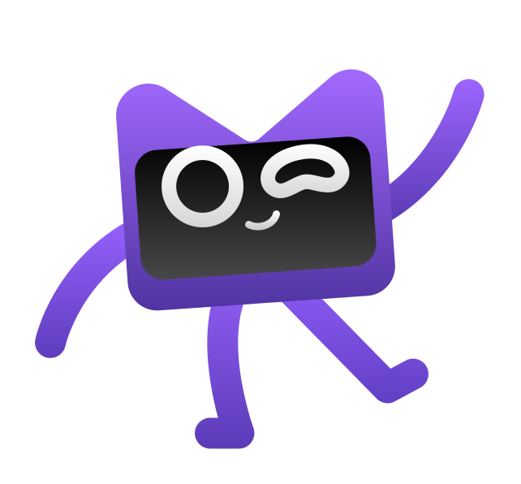

  
  

<h1 align="center">👋 Hi, I'm an Android & KMM Developer</h1>

  <b>Building scalable mobile apps with Kotlin Multiplatform</b> 
  Clean Architecture • Modular Design • Production mindset

  
  
  
  
  

---

